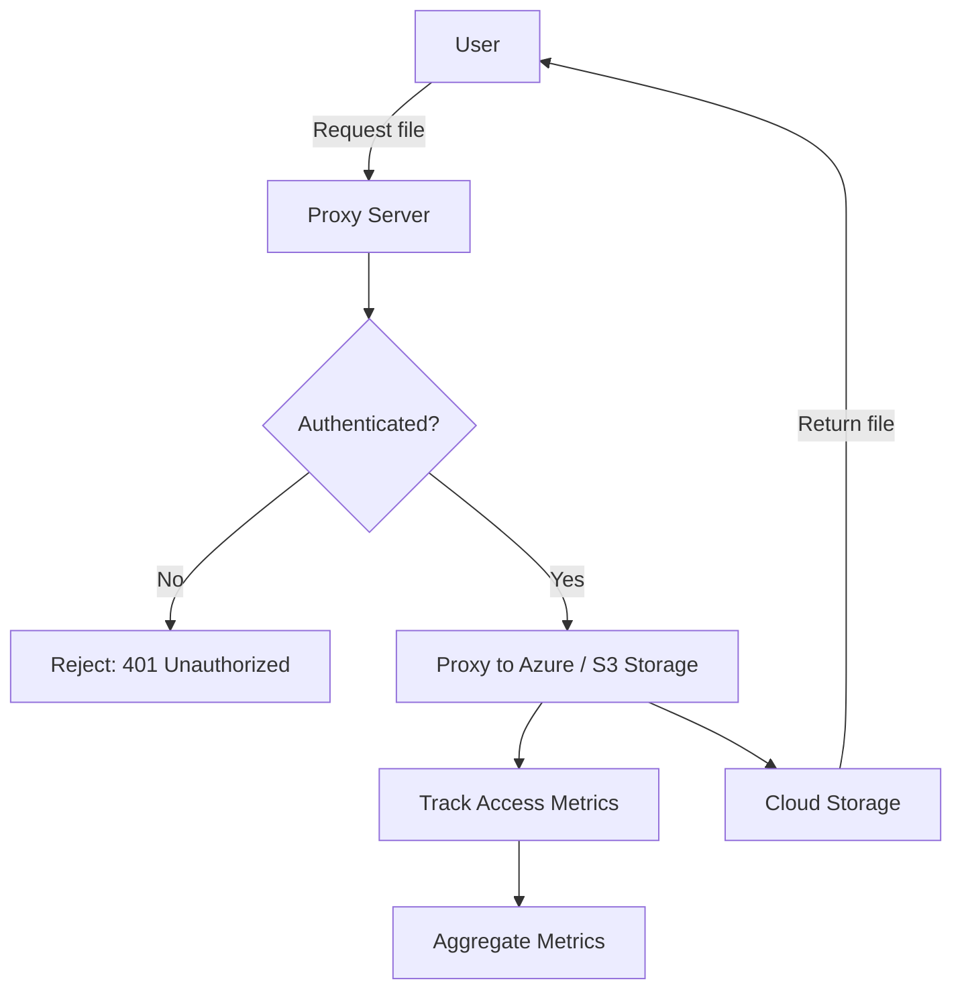
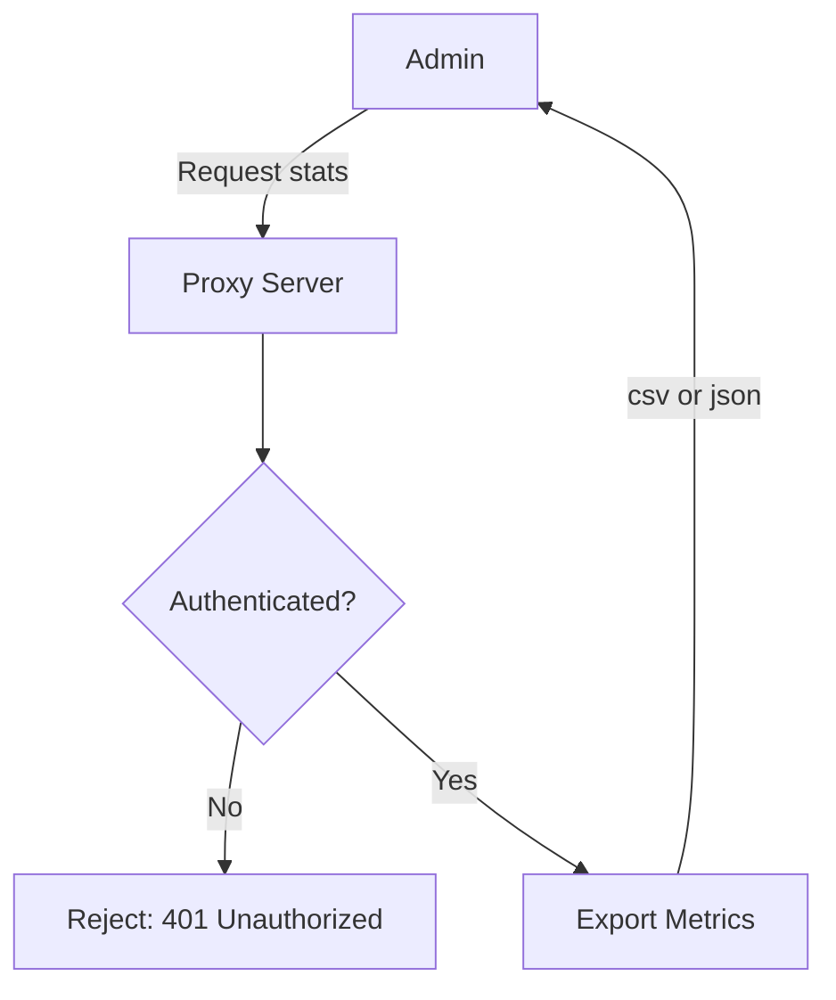

# Azure Blob / S3 Bucket Proxy Server

A secure, authenticated proxy service for Azure Blob Storage and AWS S3 buckets, using Microsoft Entra ID for authentication. Tracks file accesses and provides aggregate statistics, with OpenAPI documentation and a Scalar UI for easy exploration.

## 🚀 Features

- 🔐 Proxy requests to Azure Blob Storage containers and S3 buckets via [Hono](https://hono.dev/)
- 🔐 Authenticated access via Microsoft Entra ID (OAuth)
- 📦 Tracks accesses to files across containers/buckets
- 📈 View top accessed files collectively and per container/bucket
- 📊 Retrieve aggregate statistics collectively and per container/bucket
- 📅 Time-range filtering for metrics
- 🧪 Built-in validation via [Zod](https://zod.dev/)
- 📁 Metrics persistence to SQLite (via Drizzle ORM) with retention policy
- 📄 OpenAPI documentation at `/openapi` and interactive docs at `/docs` (Scalar UI)
- 🧑‍💻 Structured logging via Pino

## 🖼️ Architecture Diagram

### Retrieving Files



### Retrieving Metrics



## 🗂 Project Structure

```
.
├── docker/
│   └── Dockerfile               # Dockerfile for building the application
├── mock/
│   ├── aws/
│   │   ├── moto.http            # Setup S3 buckets and objects for Moto
│   │   ├── prepopulate-moto.ts  # Prepopulate Moto with test data
│   │   └── s3.js                # Signing helper for `moto.http`
│   ├── azure/
│   │   ├── azurite.http         # Setup azurite containers
│   │   ├── prepopulate-azurite.ts # Prepopulate Azurite with test data
│   │   └── az.js                # Signing helper for `azurite.http`
│   ├── test.html                # Test anchor tags
│   └── test.pdf                 # Test file
├── src/
│   ├── middleware/
│   │   ├── auth.ts              # Microsoft Entra ID authentication middleware
│   │   ├── core.ts              # Core request handler
│   │   └── logger.ts            # Structured logging middleware
│   ├── routes/
│   │   ├── files.ts             # File proxy endpoints
│   │   ├── metrics.ts           # Metrics API endpoints
│   │   ├── index.ts             # Main API router
│   │   └── files.schemas.ts     # Zod schemas for file routes
│   ├── services/
│   │   ├── azure.ts             # Azure blob provider
│   │   ├── s3.ts                # S3 bucket provider
│   │   ├── db.ts                # SQLite/Drizzle ORM setup
│   │   ├── metrics.ts           # Metrics provider
│   │   ├── logger.ts            # Logger provider
│   │   └── storage.ts           # Storage provider interface
│   ├── app.ts                   # Main Hono server
│   ├── config.ts                # Environment configuration
│   ├── server.ts                # Bun server entrypoint
│   └── types.ts                 # Type definitions
├── tests/
│   └── app.test.ts              # Bun test runner tests
├── .sample.env                  # Example environment variables
├── bun.lock                     # Bun lock file
├── docker-compose.yml           # Docker Compose configuration
├── package.json                 # Project dependencies and scripts
├── tsconfig.json                # TypeScript configuration
└── vitest.config.ts             # (Legacy) Vitest configuration
```

## 🔧 Configuration

See `.sample.env` for environment variables. Copy to `.env` and fill in your Azure Blob Storage or AWS S3 credentials and app secrets.

## 📡 API Endpoints

- `/v1/files`: List, view, and download files from containers/buckets
- `/v1/metrics`: Access metrics/statistics about file access, containers, and export metrics as JSON/CSV
- `/health`: Health check endpoint
- `/openapi`: OpenAPI spec (machine-readable)
- `/docs`: Interactive API documentation (Scalar UI)

## 🏗️ Local Usage

### Build and Serve

```bash
bun start
```

## 🐳 Docker Usage

Recommended to use `docker compose` to run the application.

1. Copy your `.env` file (with secrets/config) into the project root, or use Docker secrets/volumes as needed.
2. Run the storage-proxy container:

```bash
docker compose up -d
```

The app will be available at `http://localhost:3000` (or the port you map).

## 🧪 Development

```bash
bun install
bun run dev
```

Update database after changing Drizzle schema:

```bash
bun run drizzle-kit push
```

Run Drizzle Studio to manage database:

```bash
bun run drizzle-kit studio
```

The application will be available at `http://localhost:3000`.

### Azurite Blob Storage Emulator

See `mock/azure/azurite.http` and `mock/azure/prepopulate-azurite.ts` for helpers to create containers and test blobs in the Azurite emulator.

```bash
bun run azurite
```

### Moto AWS S3 Emulator

Moto is an in-memory server that emulates AWS services. `uv` is required with the current setup.

```bash
bun run moto
```

Then use `mock/aws/moto.http` and `mock/aws/prepopulate-moto.ts` to create buckets and upload test files.

### Testing

This project uses Bun’s built-in test runner. Run tests with:

```bash
bun test
```

> [!NOTE]
> Tests run against the mock services:
> - `Azurite` (for Azure Blob Storage) and creating test containers/blobs using `mock/azure/azurite.http`
> - `Moto` (for S3)
> - All major endpoints and edge cases are covered, including authentication, metrics, file access, and error handling.
