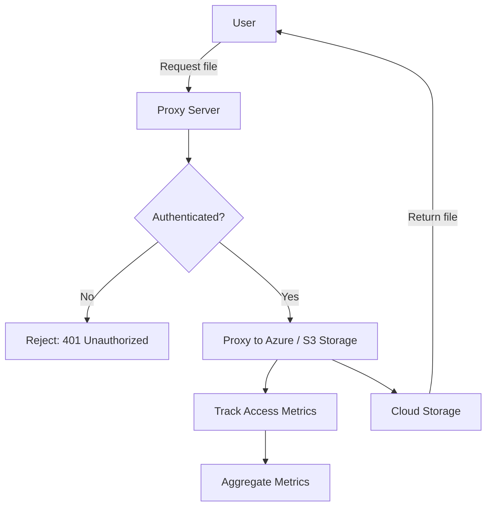
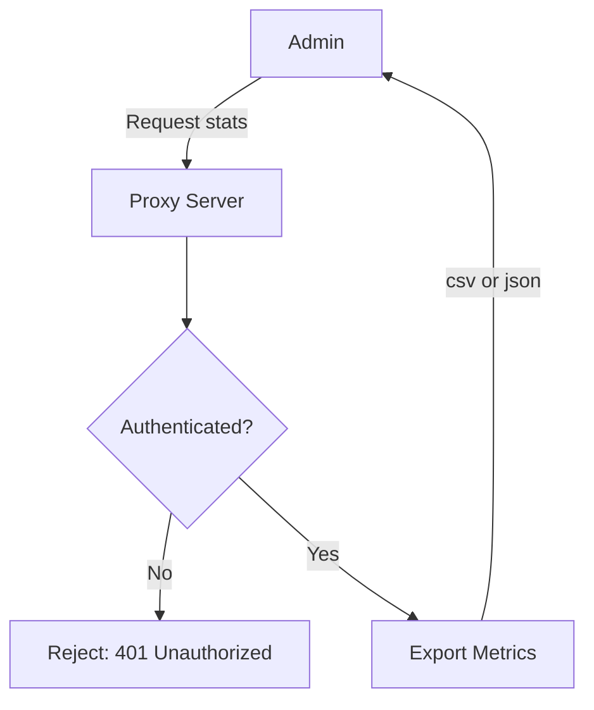

# Azure Blob / S3 Bucket Proxy Server

A secure, authenticated service for proxying anchor link requests to Azure Blob storage and S3 buckets using Microsoft Entra ID for authentication. This service tracks file accesses and provides aggregate statistics, making it easy to monitor usage.

## 🚀 Features

- 🔐 Proxy requests to Azure Blob Storage containers and S3 buckets via [Express.js](https://expressjs.com/).
- 🔐 Authenticated access via Microsoft Entra ID.
- 📦 Tracks accesses to files across containers/buckets
- 📈 View top accessed files collectively and per container/bucket
- 📊 Retrieve aggregate statistics collectively and per container/bucket
- 📅 Time-range filtering for metrics
- 🧪 Built-in validation via [Zod](https://zod.dev/)
- 📁 Metrics persistence to disk with retention policy

## 🖼️ Architecture Diagram

### Retrieving Files



### Retrieving Metrics



## 🗂 Project Structure

```
.
├── docker/
│   └── Dockerfile               # Dockerfile for building the application
├── mock/
│   ├── aws/
│   │   ├── moto.http            # Setup S3 buckets and objects for Moto
│   │   ├── prepopulate-moto.ts  # Prepupulate Moto with test data
│   │   └── s3.js                # Signing helper for `moto.http`
│   ├── azure/
│   │   ├── azurite.http         # Setup azurite containers
│   │   └── az.js                # Signing helper for `azurite.http`
│   ├── test.html                # Test anchor tags
│   └── test.pdf                 # Test file
├── src/
│   ├── middleware/
│   │     ├── auth.ts            # Microsoft Entra ID
│   │     ├── core.ts            # Request handler
│   │     └── validate.ts        # Request validation
│   ├── routes/
│   │     ├── auth.ts            # Microsoft Entra ID endpoints
│   │     ├── files.ts           # Blob/S3 proxy endpoints
│   │     ├── index.ts           # Health and Swagger endpoints
│   │     └── metrics.ts         # Metrics API endpoints
│   ├── services/
│   │     ├── azure.ts           # Azure blob provider
│   │     ├── logger.ts          # Logger provider
│   │     ├── metrics.ts         # Metrics provider
│   │     ├── s3.ts              # S3 bucket provider
│   │     └── storage.ts         # Storage provider interface
│   ├── app.ts                   # Main Express server
│   ├── config.ts                # Environment configuration
│   ├── schemas.ts               # Zod validation schemas
│   └── types.ts                 # Session types
├── tests/
│   └── app.test.ts              # Vitest tests
├── .sample.env                  # Environment variables
├── docker-compose.yml           # Docker Compose configuration
├── package.json                 # Project dependencies and scripts
├── pnpm-lock.yaml               # pnpm lock file
├── tsconfig.json                # TypeScript configuration
├── tsup.config.ts               # tsup bundler configuration
└── vitest.config.ts             # Vitest configuration
```

## 🔧 Configuration

See `.sample.env` for environment variables. Copy to `.env` and fill in your Azure Blob Storage credentials and App credentials.

## 📡 API Endpoints

This application exposes a Swagger API at `/api` for easy testing and exploration.

## 🏗️ Local Usage

### Build and Serve

```bash
# build the application
pnpm build
# serve the application
pnpm start
```

## 🐳 Docker Usage

Recommended to use `docker compose` to run both the application and [Valkey](https://valkey.io/).

1. Copy your `.env` file (with secrets/config) into the project root, or use Docker secrets/volumes as needed.

2. Run the storage-proxy and Valkey containers:

```bash
docker compose up -d
```

The app will be available at `http://localhost:3000` (or the port you map).

## 🧪 Development

```bash
pnpm install
pnpm dev
```

### Azurite Blob Storage Emulator

See `mock/azure/azurite.http` for a helper to create containers and test blobs in the Azurite emulator.

### Moto AWS S3 Emulator

`uv` is required. Moto is an in-memory server that emulates AWS services.

```bash
pnpm moto
```

Then use `mock/aws/moto.http` to create buckets and upload test files.

### Testing

This project uses [Vitest](https://vitest.dev/) for testing. Run tests with:

```bash
pnpm test
```

> [!NOTE]
>
> Tests run against the mock services:
> - `Azurite` (for Azure Blob Storage) and creating test containers/blobs using `mock/azure/azurite.http`
> - `Moto` (for S3)
